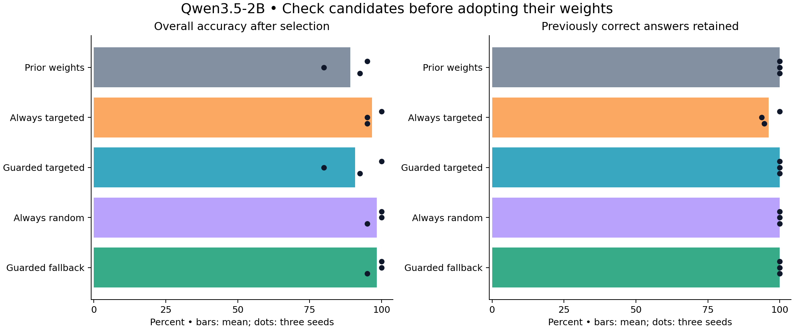

# Gated continual learning

Can a small local language model learn useful new facts, reject bad information,
and avoid damaging what it already knows? This repository contains our controlled
fictional-world experiments with Qwen2.5-1.5B and Qwen3.5-2B.

**Start with the [plain-language findings report](FINDINGS_REPORT.md).**

The main finding: deciding **what deserves learning** and checking **whether the
resulting weight update deserves adoption** are separate jobs. Selective learning
helped in the mixed-information test; replay sometimes protected knowledge and
sometimes introduced interference. A candidate-promotion gate blocked the known
damaging updates in a retrospective test. These are small pilot results, not a
claim of general truth detection or solved continual learning.



## What's included

- Every experiment's source code, fixed protocol, fictional data, development
  failures, numerical reports, summaries and charts under [`study/`](study/).
- The original 0.5B execution canary, both main model comparisons, evidence
  reassessment, repair, replay-buffer stability, measured-forgetting replay and
  candidate promotion.
- **85 trained adapters**, distributed as checkpoint ZIPs on the
  [v0.1.0 release](https://github.com/several-dozen-lizards/gated-continual-learning/releases/tag/v0.1.0).
  See [`CHECKPOINTS.json`](CHECKPOINTS.json) for sizes and SHA-256 checksums.
- A portable reproduction entry point and CPU-only checks.

Base model weights and installed third-party packages are not republished. Model
IDs and exact revisions are recorded in the study. Download base models from
their upstream repositories; checkpoint ZIPs contain the learned adapters only.

## Read and verify without a GPU

Use Python 3.10 or newer:

```console
python verify_publication.py
python run_cpu_tests.py
```

The first command verifies the published evidence files. The second runs routing,
selection and activation tests. Neither trains a model or downloads weights.
All 27 CPU tests and fresh-workspace preparation passed on the publication copy.
The original GPU runs are recorded; the full GPU sequence has not been rerun from
this newly packaged checkout.

## Reproduce with a GPU

The original runs used an RTX 5060 with 8GB VRAM, CUDA-capable PyTorch,
Transformers 5.13.1, PEFT 0.19.1, Accelerate 1.15.0 and bitsandbytes 0.49.2.
The environment inventory is in [`requirements-recorded.txt`](requirements-recorded.txt).
Install a PyTorch build appropriate for your GPU first, then the remaining
dependencies. Hardware/backend differences can change numerical results.

```console
python reproduce.py --prepare-only
python reproduce.py --stage qwen35
python reproduce.py --stage reassessment
python reproduce.py --stage repair
python reproduce.py --stage buffer_stability
python reproduce.py --stage drift_replay
python reproduce.py --stage promotion_gate
```

The first command creates a fresh `work/` tree without network or GPU access.
Later commands download the pinned base model as needed and run actual GPU work.
Expect multi-gigabyte downloads and sustained training/evaluation time. Keep about
3GB of GPU memory free before model loading; the recorded runs used around 6GB
total GPU memory including desktop workloads.

`--stage initial` reproduces the separate Qwen2.5-1.5B comparison. `--stage all`
runs both model comparisons and the full Qwen3.5 continuation sequence. Stages
refuse to overwrite existing runs. Choose a new `--workdir` to start again.
Continuation stages require their predecessor to have completed in the same tree.
The original canary is preserved but not part of this automated sequence; it used
a cached 0.5B derivative and was only an execution check.

## Publication and reproducibility boundaries

The original experimental files remain unchanged on the author's machine. This
publication copy removes machine-specific absolute paths, makes report links
relative, and replaces local-service Python launchers with ordinary Python.
Adapter metadata points to the upstream model rather than a private cache path.
Adapter tensor bytes are unchanged.

Historical protocol/receipt hashes describe the original files. Path-redacted
records therefore do **not** satisfy every historical byte-level hash check.
[`PUBLICATION_MANIFEST.json`](PUBLICATION_MANIFEST.json) records original and
published checksums and every changed file. Reproduction creates new paths,
protocol hashes and receipts in `work/`; it does not relabel archived outcomes as
new runs. Do not run the archival `prepare.py`/`summarize.py` scripts directly in
`study/`, which already contains completed receipts and redacted paths.

Extract release checkpoint ZIPs at the repository root to restore their
`study/...` adapter paths. For inference, load the pinned base model explicitly
and then the adapter with PEFT. Published active-adapter manifests contain
`${EXPERIMENT_ROOT}` placeholders; resolve these to your local `study/` directory.
Exact replay from historical checkpoints also requires rebasing local paths and
accounting for redacted metadata hashes; the supported training path is the fresh
reproduction workflow above.

## Limits

Three related fictional variants, four-color answer scoring, repeated training,
supplied source reliability and corrections, and reused evaluation wording are
deliberate limitations. Later stages branch from earlier checkpoints, including
damaged ones. The candidate gate was tested on previously known candidates.
No resident model, general conversational performance, energy savings, or
autonomous fact-checking capability was established.

Project license: not yet specified. Upstream models and dependencies retain their
own licenses; see their model cards and package repositories.
